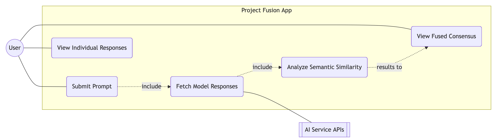
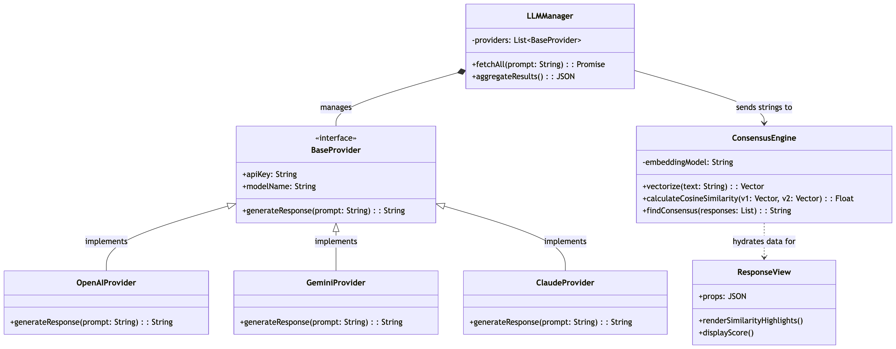
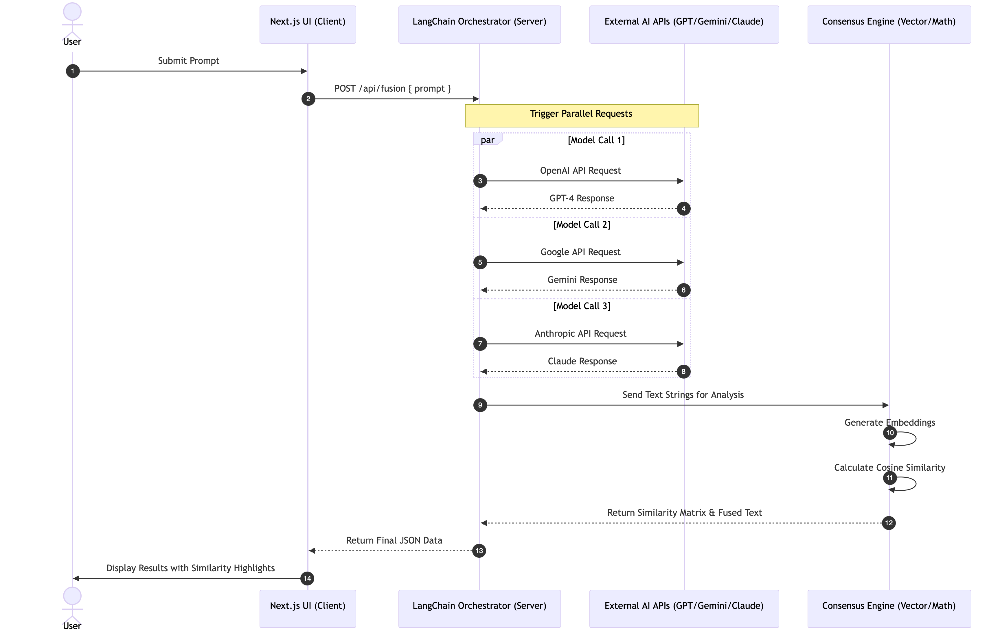

## 6.1 Introduction Section
This document presents the architecture and detailed design for the software for **Fusion**. The project performs a comparative semantic analysis of responses generated by multiple Large Language Models (LLMs) to identify a reliable consensus. By utilizing vector embeddings and similarity scoring, the system filters out "hallucinations" and provides users with a grounded, multi-source validated answer.

### 6.1.1 System Objectives Section
The primary objective of Fusion is to increase the reliability of AI generated information. While individual LLMs are prone to confidently stating inaccuracies, the likelihood of multiple independent models hallucinating the same specific falsehood is significantly lower. This application aims to:
* Centralize LLM Queries: Provide a single interface to prompt ChatGPT, Gemini, and Claude simultaneously.
* Quantify Agreement: Use mathematical models to score how closely different AI responses align.
* Synthesize Truth: Extract and highlight the overlapping "consensus" facts to give the user a high confidence result.

### 6.1.2 Hardware, Software, and Human Interfaces Section

* **6.1.2.1 Human Interface** The user will interact with a responsive Web GUI built in Next.js. The interface includes a primary text input for prompts and a "Fusion View" that displays a response with highlighted semantic overlaps.

* **6.1.2.2 Software Interface** The system interfaces with OpenAI (GPT-4), Google (Gemini 1.5 Pro), and Anthropic (Claude 3.5) via their respective APIs. All communications are handled server side via HTTPS to secure API keys.

* **6.1.2.3 Software Interface** Fusion utilizes LangChain v0.3 as the orchestration layer to standardize the input/output schemas across different model providers. This library acts as the middleware between the frontend and the raw API endpoints.

* **6.1.2.4 Hardware Interface** The application is hosted on cloud infrastructure (Vercel) and requires a standard network interface for API communication. The server side logic executes on virtualized CPU resources provided by the cloud host.

---

## 6.2 Architectural Design Section
The architecture of Fusion follows a Modular Client Server pattern. The system is designed to be highly decoupled: the "LLM Aggregator" does not need to know how the "Similarity Engine" calculates its scores, only that it receives text and returns a float. This ensures that as new models are released, they can be added as new modules without refactoring the core consensus logic.

### 6.2.1 Major Software Components Section
1.  Request Orchestrator: Manages the asynchronous calls to multiple AI engines, ensuring the UI doesn't hang while waiting for the slowest model.
2.  Vectorization Service: Converts raw text from LLMs into using OpenAI or HuggingFace embeddings.
3.  Consensus Engine: The mathematical core that runs Cosine Similarity algorithms to find the "centroid" of the provided answers and determine the degree of overlap.

### 6.2.2 Major Software Interactions Section
When a user submits a prompt, the Request Orchestrator triggers parallel hooks to the LLM APIs via LangChain. Once all strings are returned, they are passed to the vectorization service. The resulting vectors are sent to the Consensus Engine, which calculates a similarity matrix. The frontend then maps these scores back to the UI to visually "fuse" the answers for the user.

### 6.2.3 Architectural Design Diagrams Section

#### 6.2.3.1 Use Case Diagram
  

#### 6.2.3.2 Top-Level Class Diagram
  

#### 6.2.3.3 Sequence Diagram

#### 6.3 CSC and CSU Descriptions Section
## 6.3.1 Detailed Class Descriptions Section

## 6.3.1.1 LLMProvider (Base Class): An abstract class defining the standard interface for AI models.

Fields: modelName (string), apiKey (string), temperature (float).

Methods: generateResponse(prompt: string): Returns a raw string from the provider.

## 6.3.1.2 ClaudeProvider / GPTProvider / GeminiProvider: Subclasses inheriting from LLMProvider that implement the specific API logic for each model.

## 6.3.1.3 ConsensusEngine: The mathematical core of the app.

Fields: threshold (float - the minimum similarity score to consider a "match").

Methods: calculateSimilarity(vectors: number[][]): Returns a similarity matrix. findCentroid(responses: string[]): Identifies the most representative response.

## 6.3.1.4 VectorService: Handles the transformation of text to math.

Fields: embeddingModel (string).

Methods: embedText(text: string): Calls the embedding API to return a vector.

## 6.3.2 Detailed Interface Descriptions Section

In Fusion, these descriptions focus on the data exchange between the Frontend (Next.js) and the Orchestration Layer (LangChain).

Clien-to-Server Interface: Describes the JSON payload sent from the UI (user prompt, model toggles) to the /api/fuse endpoint.

Orchestrator-to-LLM Interface: Describes how LangChain normalizes the various schemas from OpenAI, Google, and Claude into a unified format.

## 6.3.3 Detailed Data Structure Descriptions Section

Similarity Matrix: A 2D array (e.g., Float32Array) representing the cosine similarity between every pair of LLM responses.

FusedResponse Object: A complex JSON object containing the original strings, their vector coordinates, and the final "consensus" text with metadata on confidence levels.

#### 6.4 Database Design and Description Section
Fusion utilizes Supabase (PostgreSQL) to manage user sessions and history.

## 6.4.1 Database Design ER Diagram: 
This will show the relationship between Users, Queries, and LLM_Responses. One Query has many Responses.

## 6.4.2 Database Access: 
Access is managed via the Supabase Client SDK. The server-side logic handles all CRUD operations to ensure users can only view their own "Fusion" history.

## 6.4.3 Database Security: 
We implement Row Level Security (RLS) policies in PostgreSQL. This ensures that even if a JWT is intercepted, data is isolated at the database level.
