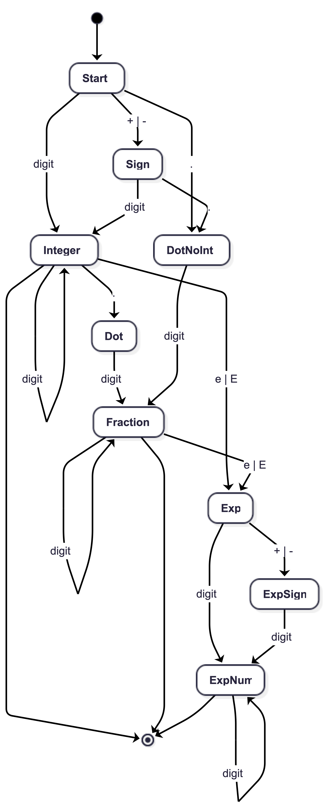
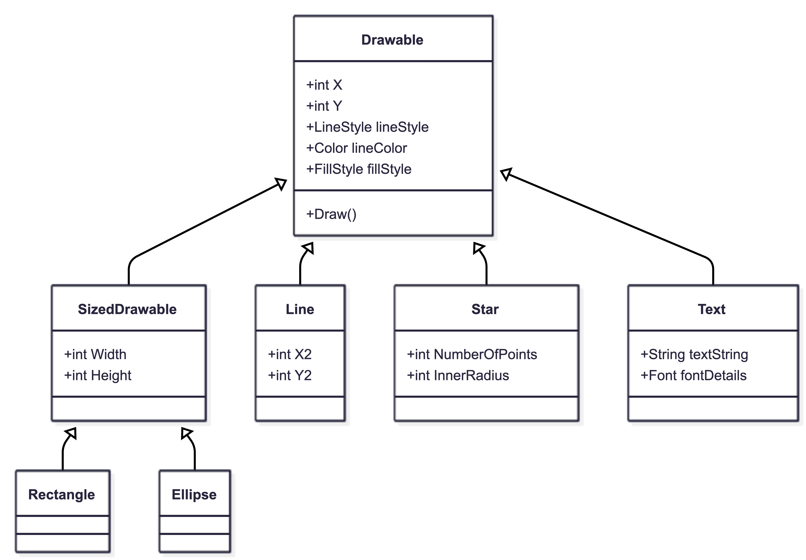

# Homework 2
## Problem 5.1, Stephens page 116

What's the difference between a component-based architecture and a service-oriented architecture?
In component-based architecture, pieces of code are decoupled into components that provide services to each other, but all these pieces are typically contained within the same executable program. In an SOA, the application is built from a collection of services that communicate with each other through well defined interfaces, often over a network. The primary difference is the level of separation: SOA services are usually independent and can be distributed across different systems, whereas components are generally internal to a single application.
## Problem 5.2, Stephens page 116

Suppose you're building a phone application that lets you play tic-tac-toe against a simple computer opponent. It will display high scores stored on the phone, not in an external database. Which architectures would be most appropriate and why?

Monolithic Architecture: This is the most appropriate because the application is simple, self mcontained, and does not need to share data with external systems or multiple users. Since the high scores are stored locally on the phone and there is no external database, a single program can handle the user interface, the computer opponent logic, and the local data storage without the complexity of a service-oriented design.

## Problem 5.4, Stephens page 116

Repeat question 3 [after thinking about it; it repeats question 2 for a chess game] assuming the chess program lets two users play against each other over an Internet connection.
Client/Server Architecture: This is necessary to facilitate communication between the two players. A server is required to act as the central point where both players' moves are received and synchronized. A three-tier architecture might be even better, using a middle tier to handle the game logic and ensure neither player is cheating before updating the game state in the database.

## Problem 5.6, Stephens page 116

What kind of database structure and maintenance should the ClassyDraw application use?
File-Based Storage: ClassyDraw stores drawings in files rather than a relational database.
Maintenance: Because it uses files, formal database maintenance is generally unnecessary and would be "overkill" for a simple drawing application

## Problem 5.8, Stephens page 116 DO THIS

Draw a state machine diagram to let a program read floating point numbers in scientific notation as in +37 or -12.3e+17 (which means -12.3 x 1017). Allow both E and e for the exponent symbol. [Jeez, is this like Dr. Dorin's DFAs, or what???]

## Problem 6.1, Stephens page 138

Consider the ClassyDraw classes Line, Rectangle, Ellipse, Star, and Text.

What properties do these classes all share?
What properties do they NOT share?
Are there any properties shared by some classes and not others?
Where should the shared and nonshared properties be implemented?

Shared Properties: All these classes share basic drawing properties such as Location (X, Y coordinates), LineStyle, LineColor, and FillStyle.
Non-Shared Properties: Rectangle and Ellipse have Width and Height; Star might have NumberOfPoints and InnerRadius; Text has a String property and Font details; Line has a destination (X2, Y2).
Properties shared by some but not others: Width and Height are shared by Rectangle and Ellipse but not by Line.
Implementation: Shared properties should be implemented in a general parent class (like Drawable), while non-shared properties should be implemented in the specific child classes.

## Problem 6.2, Stephens page 138 DO THIS

Draw an inheritance diagram showing the properties you identified for Exercise 6.1. [Create parent classes as needed, and don't forget the Drawable class at the top.]

 
